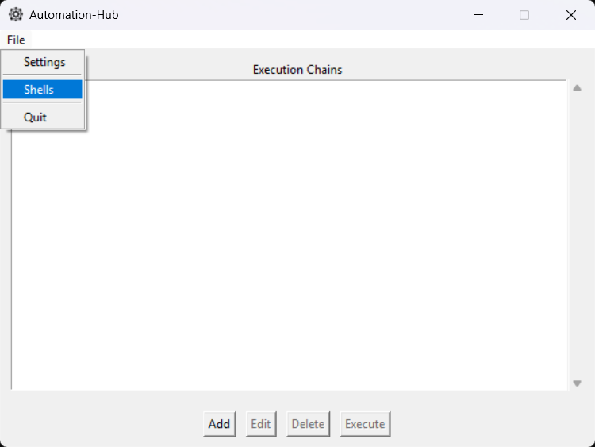
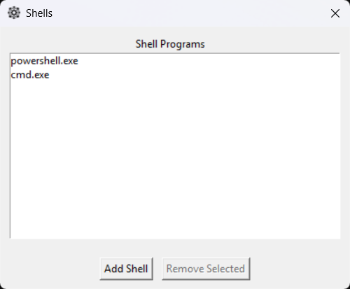
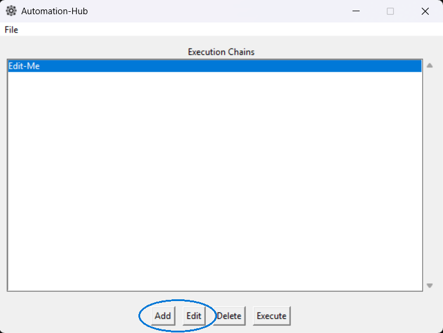
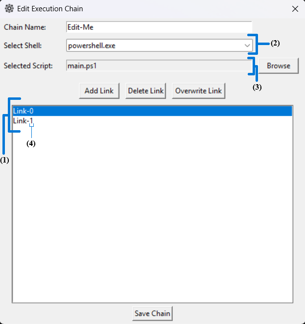
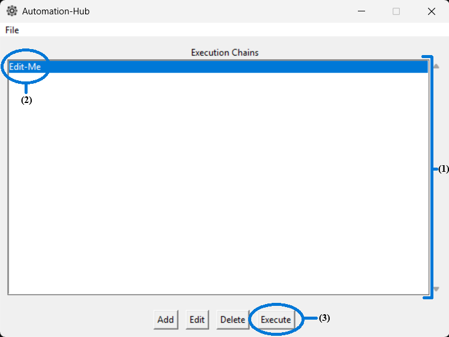

# Automation Hub
A lightweight shell script launcher.

## Contents
- [INSTALLATION](#installation)
- [USAGE](#usage)
  - [Adding Shell Programs](#adding-shell-programs)
  - [Adding and Editing Execution Chains](#adding-and-editing-execution-chains)
  - [Executing Chains](#executing-chains)
- [SETTINGS](#settings)
  - [File Display](#file-display)
- [RUNNING FROM SOURCE CODE](#running-from-source-code)

# Installation
1. [Download the latest release.](https://github.com/gtkachyk/Automation-Hub/releases/download/v0.1.0/Automation-Hub.zip)
2. Extract the Automation-Hub folder. The location does not matter.
3. The application can be launched by running Automation-Hub/automation_hub.exe.

# Usage
## Adding Shell Programs
You can add shell programs to execute your scripts by accessing the Shells window via the File menu.

File Menu Access:<br>


Shell Window:<br>
<br>
*The shell programs above were added for demonstrative purposes.*

## Adding and Editing Execution Chains
Execution chains allow you to sequence multiple shell scripts to run in a specified order using specific shells for each script.<br>
You can create create and modify execution chains in the Edit Execution Chain window.<br>
Access this window by pressing the Add button or Edit button on the main window.

Edit Execution Chain Window Access Buttons:<br>


Edit Execution Chain Window:<br>


Chains are created or lengthened by adding links (1).<br>
A link is comprised of a shell program (2) and shell script (3) to be executed by the shell program.<br>
Each link in a chain has an index (4), allowing them to be easily sorted.

## Executing Chains
To run your execution chains, close any popup windows opened by the application if needed and go to the main window.

Main Window:<br>
<br>
*The execution chain depicted above ships with the program, but it contains no links initially.*

Saved execution chains are listed by name in the main window's display area (1).<br>
Chains can be selected from the list (2) and then run by pressing the Execute button (3).<br>
The links in a chain will be run in ascending order of index.<br>

# Settings
To open the settings window, open the File menu and select Settings. After making changes, save them by pressing Save.

## File Display
Changing this setting allows you to control how files are displayed in the user interface. This does not affect how your data is stored.

# Running from Source Code
1. Create a folder for the source code:
```
mkdir Automation-Hub
```
2. Clone the repository with:
```
cd Automation-Hub
git clone git@github.com:gtkachyk/Automation-Hub.git
```
3. Run main.py:
```
python main.py
```